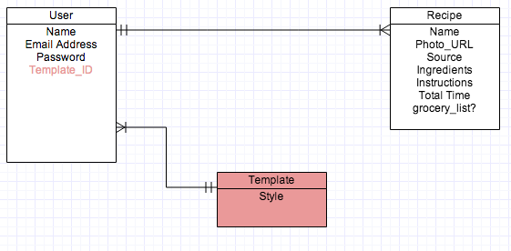

#MyCookbook

##General Assembly WDI May 30, Project 1

##Overview

MyCookbook is a web application that allows users to compile their very own "Cookbook" using recipes gathered through either (a) form-based submission (for family or personal recipes), or (b) a search of hundreds of thousands of recipes using BigOven's API. Users also can use the Grocery List feature to compile a shopping list using the ingredients from selected recipes in their Cookbook. Please sign up for full functionality, as back-end authentication was a focus on this project.

MyCookbook was developed for a project for the April 2014 Web Development Immersive course at General Assembly. It was developed over a week-long sprint to model the agile software development process.

##Technologies Used
* Ruby 2.1.1
* Rails 4.1.1
* PostgreSQL Database
* Authentication & Authorization from scratch using [b-crypt-ruby](http://bcrypt-ruby.rubyforge.org/ "bcrypt-ruby")
* [BigOven API](http://api.bigoven.com/ "BigOven API") & [HTTParty](https://github.com/jnunemaker/httparty "HTTParty")
* Testing using [rspec-rails](https://github.com/rspec/rspec-rails), [capybara](https://github.com/jnicklas/capybara), [shoulda-matchers](https://github.com/thoughtbot/shoulda-matchers), [ffaker](https://github.com/EmmanuelOga/ffaker), and [factory_girl_rails](https://github.com/thoughtbot/factory_girl_rails)
* Front-end design from scratch using [Sass Rails](https://github.com/rails/sass-rails)

##User Stories Completed
* As a user, I can sign up for an account with an email address and password
* As a user, I can login and logout of my account
* As a user, I can perform basic recipe search by entering search terms
* As a user, I can see a list of search results and link to a specific  search result
* As a user, I can save specific search results to my Cookbook
* As a user, I can enter my own recipe and add it to my Cookbook
* As a user, I can see a list of the recipes saved to my Cookbook
* As a user, I can edit all recipes in my Cookbook, regardless of origin
* As a user, I can delete recipes from my Cookbook
* As a user, I can select recipes to add to my Grocery List
* As a user, I can clear my Grocery List

##Production
Explore MyCookbook for yourself on [Heroku](http://myc00kb00k.herokuapp.com/)

##Backlog
A full list of user stories can be found by looking at [this Pivotal Tracker](https://www.pivotaltracker.com/s/projects/1086748 "Pivotal Tracker")

Below is the ERD for MyCookbook, including plans to add a customizable styling element for each user.

